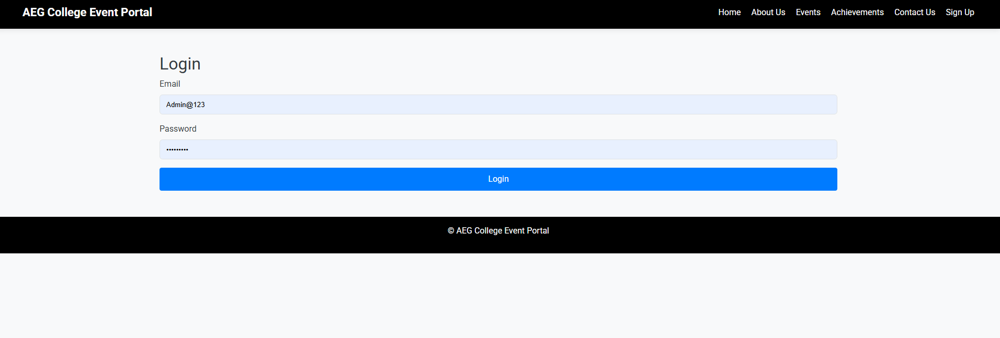
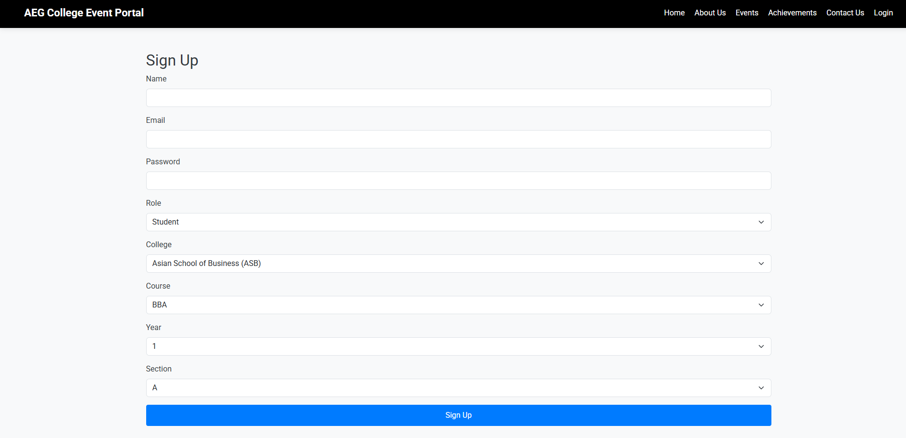
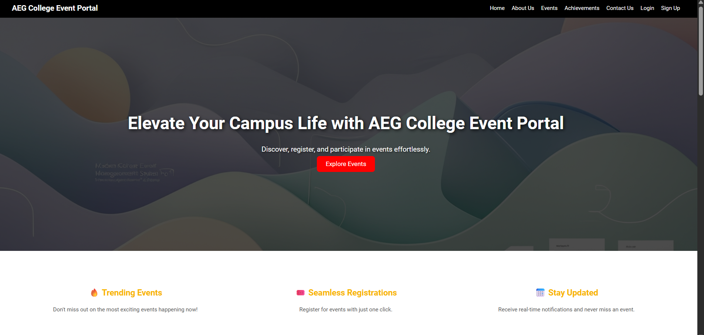
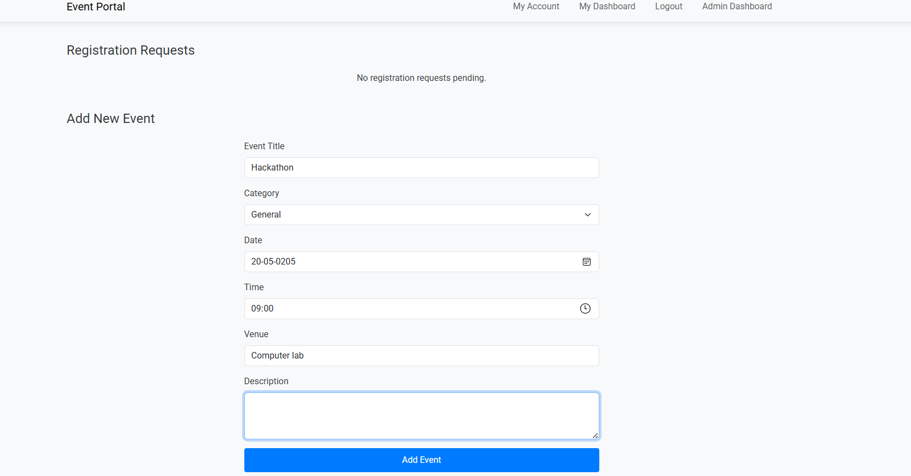
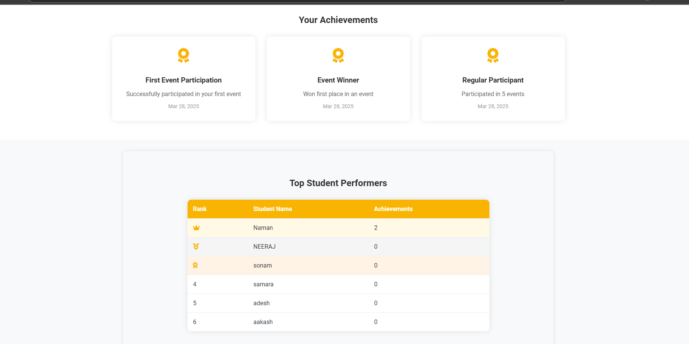

# 📅 Event Management System

A web-based application for managing events, built using HTML, CSS, JavaScript, PHP, and MySQL. This system allows users to create, manage, and track events, with features for user authentication, event management, and feedback collection.

## 🛠️ Features

- **User Authentication**: Secure login and signup functionality.
- **Event Management**:
  - Create and manage events
  - Track event details and attendance
  - View event feedback
- **User Dashboard**: Personalized dashboards for admins and faculty.
- **Feedback System**: Collect and view feedback for events.
- **Responsive Design**: User-friendly interface with HTML, CSS, and JavaScript.
- **MySQL Integration**: Persistent data storage for users, events, and feedback.

## 📸 Screenshots

Here are a few screenshots showcasing the project interface and functionalities.

### 🖥️ Login Page


### 📝 Signup Page


### 🏠 Homepage


### 📅 Add Event


### 🏆 Achievements Page


## 🔧 Technologies Used

- **HTML**
- **CSS**
- **JavaScript**
- **PHP**
- **MySQL**
- **XAMPP** (for local development)

## 🧩 Project Structure
event_management_system/
│
├── css/                    # Stylesheets for the application
├── images/                 # Images used in the application
├── js/                     # JavaScript files for interactivity
├── screenshots/            # Screenshots of the application
├── about.php               # About page
├── achievements.php        # Achievements page
├── admin_panel.php         # Admin dashboard
├── admin.php               # Admin-specific functionalities
├── approve.php             # Approve events or users
├── attendance.php          # Track event attendance
├── config.php              # Database connection configuration
├── create_achievements_table.php  # Script to create achievements table
├── create_event.php        # Create new events
├── create_login_attempts_table.php  # Script to create login attempts table
├── create_remember_tokens_table.php  # Script to create remember tokens table
├── dashboard.php           # User dashboard
├── db.php                  # Database setup script
├── error_log.php           # Error logging
├── event_details.php       # Display event details
├── event_management_db.sql  # Database schema
├── event.php               # Event page
├── faculty_dashboard.php   # Faculty dashboard
├── feedback.php            # Feedback page
├── fetch_events.php        # Fetch events for display
├── fetch_events_log.txt    # Log for fetched events
├── footer.php              # Footer template
├── hash.php                # Hashing utilities
├── header.php              # Header template
├── index.php               # Homepage
├── login.php               # Login page
├── logout.php              # Logout functionality
├── my_account.php          # User account page
├── signup.php              # Signup page
├── view_attendance.php     # View attendance records
└── README.md               # This file

text

Copy

## 💾 Database Schema

**Tables Used:**

- `achievements`: Stores achievements data.
- `events`: Stores event details (title, date, description, etc.).
- `attendance`: Tracks attendance for events.
- `feedback`: Stores feedback for events.
- `login_attempts`: Logs login attempts for security.
- `remember_tokens`: Stores tokens for "remember me" functionality.
- `users`: Stores user details (username, password, role, etc.).

## 🔐 Security Notes

- Passwords are hashed for secure storage (via `hash.php`).
- Basic input validation on forms.
- Consider adding prepared statements to prevent SQL injection.

## 🚀 Getting Started

### Prerequisites

- XAMPP (or any PHP/MySQL server)
- Web browser
- Code editor (e.g., VS Code)

### Setup Instructions

1. Clone or download the project to your local machine.
2. Place the project folder in `C:\xampp\htdocs\` (or your server’s root directory).
3. Start XAMPP and ensure Apache and MySQL are running.
4. Create a MySQL database named `event_management_db` and import the `event_management_db.sql` file.
5. Update the database credentials in `config.php`:
   ```php
   $host = 'localhost:3306'; // Adjust port if needed
   $username = 'root';
   $password = ''; // Default for XAMPP
   $database = 'event_management_db';
Open your browser and navigate to http://localhost/event_management_system/.
📦 Future Improvements
Add email notifications for event updates.
Implement role-based access control (e.g., separate admin and user roles).
Enhance security with prepared statements and CSRF protection.
Add a calendar view for events.
🙋‍♂️ Author
NAMAN RAI
GitHub
Email: namanr073@gmail.com